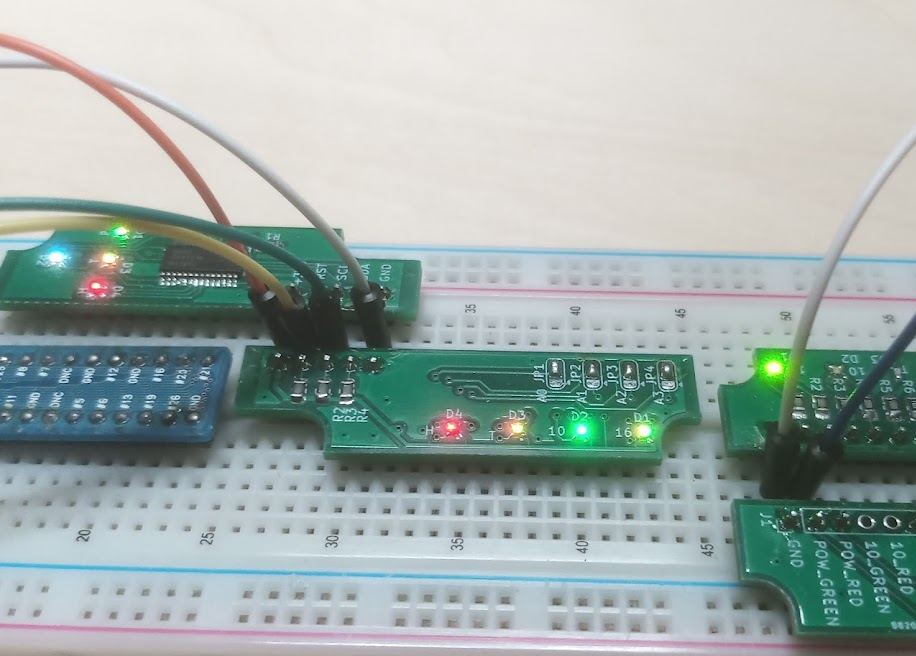

# X68000 XVI風/初代風Raspberry Piケース用電飾基板

イベントや個人通販で頒布していた電飾基板の解説および関連スクリプトです。

(株)ヘルメッツ様のRaspberry Pi用  
* X68000 XVI風ケース(MONAC-002)  
* X68000初代風ケース(MONAC-003)

それぞれのケースに合わせて、
* I2C経由でRGB LEDを操作するI2C版
* GPIOピンをHレベルにすることで各LEDが点灯するGPIO版

の4通りを頒布していました。