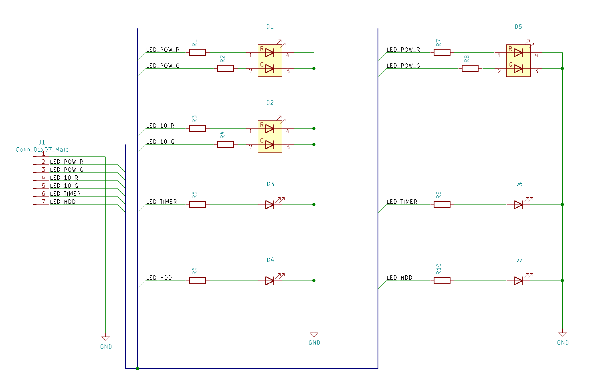

# mini XVI LED GPIO制御版 説明書
# mini X68 LED GPIO制御版 説明書

## 1. はじめに
拙作を手にとっていただきありがとうございます。  
この基板は、(株)ヘルメッツ様のRaspberry Pi用  
X68000 XVI風ケース(MONAC-002)、もしくは  
X68000初代風ケース(MONAC-003)を電飾するための基板です。

それぞれ別の基板ですが、使い方は共通であるため、
両者で兼用の説明書とさせていただいております。

### 1.1. 特徴
* ケースの電飾穴に収まる極小サイズのLEDにより、隣のLEDの光の回り込みを完全に排除
* 右タワーの全ての電飾用穴をLED電飾可能
* 設定が比較的容易なGPIOによる直接駆動を採用
* 電源インジケータLEDは黄緑/赤の2色仕様
* HDDおよびTIMER LEDは赤単色仕様
* 電流制限抵抗付きでRaspberry PiのGPIO端子へ直結が可能

### 1.2. 使用するために必要なもの
* Raspberry Pi model 2B/3B/3B+ のいずれか  
  これ以外のモデルでも動作する筈ですが、上述のケースに上手く収まりません。
* ICの半田付けが必要な電子工作キットを一発動作させるだけの技能
* 上記半田付けに必要な機材
* 配線材料各種
* 『ラズパイでLチカ』をするための手順を自力で調べ、内容を理解できる能力
* 英文の資料しか無くても何とかする能力
* トラブルをも楽しめる大らかな心

### 1.3. 注意事項
* いきなり半田付けせず、一旦仮組みしてみて、各部が干渉しないことを確認してください。
* 光り物故に相当な電力を消費します。  
この基板だけで最大3.3V 100mAを消費しうるため、他の拡張基板との併用時には余裕があるか必ず確認してください。
* 基板の空きパターン部分にLEDを実装して使用することは想定していません。

## 2. 内容物をご確認ください
* 実装済み基板
* スペーサー用プラ角棒

で1セットです。

基板の種類が間違っていないかを確認してください。  
半田付け後、または納品一週間以後の交換には応じかねます。  
基板のどちらかの面にのみ部品が実装されており、
部品が実装されている(デコボコしている)面を表にした時の写真が以下になります。

### XVIタイプ(MONAC-002)用


### 初代タイプ(MONAC-003)用


輸送中に破損していた場合は運送会社へお問い合わせください。

半田付けが必須であるという性質上、保証期間はありません。

## 3. 使い方
### 3.1. 結線情報
この基板はカソードコモンの配線になっています。  
基板上の"J1"で示された端子群のうち"GND"と印字された端子がカソードに相当します。

J1の残りの端子は電流制限抵抗を経由し各LEDのアノード側に接続されています。

#### 3.1.1. mini XVI用基板の場合
```
GND       : 全LEDのカソード
POW_RED   : D1 RED
POW_GREEN : D1 GREEN
10_RED    : D2 RED
10_GREEN  : D2 GREEN
TIMER     : D3
HD        : D4
```

#### 3.1.2. mini X68初代用基板の場合
```
GND       : 全LEDのカソード
POW_RED   : D5 RED
POW_GREEN : D5 GREEN
TIMER     : D6
HD        : D7
```

初代タイプ用基板では`10_RED`および`10_GREEN`は使用しません。

### 3.2. Raspberry Piとの接続
基板上の`J1`の`GND`端子をRaspberry PiのGND端子に接続します。  
残りの端子を適切なGPIOへ接続します。  
この基板では定番もしくは推奨とされる接続位置はありません。

### 3.3. ソフトウェアの準備や設定
この基板は『Raspberry PiでLチカ』と呼ばれる行為の延長線上にあるものです。  
既に数多の前例があり、個々に解説するにはスペースが足りず、  
また、特定の記事を紹介するには少々無理があります。  
各自で調べていただくのが最も近道かと存じます。

### 3.4. 基板の設置
意図した通りに点灯する事を確認できたら、基板をケースのフロントパネルに入れてみます。

部品位置に対する基板外形の公差が大きいため、若干隙間ができる寸法にしてあります。  
外周に紙を挟むなどして電飾穴とLEDの位置関係、および基板固定の固さを調整するしてください。   
基板の傾きについては添付のプラ角棒を利用すると便利かと思います。


## 4. 回路図
