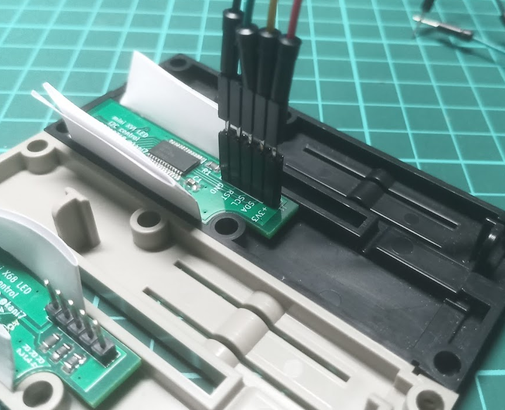
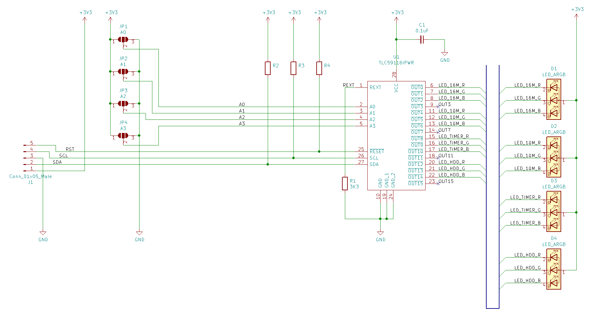

# mini XVI LED I2C制御版 説明書
# mini X68 LED I2C制御版 説明書

## 1. はじめに
拙作を手にとっていただきありがとうございます。
この基板は、(株)ヘルメッツ様のRaspberry Pi用  
X68000 XVI風ケース(MONAC-002)、または  
X68000初代風ケース(MONAC-003)を電飾するための基板です。

それぞれ別の基板ですが、部品配置以外はほぼ共通であるため、
両者で兼用の説明書とさせていただいております。

### 1.1. 特徴
* ケースの電飾穴に収まる極小サイズのLEDにより、隣のLEDの光の回り込みを完全に排除
* 極小サイズのLEDにより、最大限の混色性を確保
* 右タワーの全ての電飾用穴をLED電飾可能
* 全てRGB LEDを使用しており、任意に調色可能
* I2C接続のLEDドライバTLC59116による多彩な制御
* I2Cアドレス変更可能
* 少ない配線数で全てを制御できる一方、手続きが非常に複雑

### 1.2. 使用するために必要なもの
* Raspberry Pi model 2B/3B/3B+ のいずれか  
  これ以外のモデルでも動作する筈ですが、上述のケースに上手く収まりません。
* ICの半田付けが必要な電子工作キットを一発動作させるだけの半田付け技能
* 上記半田付けに必要な機材
* 配線材料各種
* 2進数/10進数/16進数を相互に変換、および加減算できる手段
* UNIX系OSの初歩的な管理知識
* CUI(コマンドライン)のみでの操作経験
* 英文の資料しか無くても何とかする気合
* トラブルをも楽しめる大らかな心

### 1.3. 注意事項
* いきなり半田付けせず、一旦仮組みしてみて、各部が干渉しないことを確認してください。
* 光り物故に相当な電力を消費します。  
  この基板だけで最大3.3V 141mAを消費しうるため、他の拡張基板との併用時には余裕があるか必ず確認してください。
* I2Cアドレスは必ず設定してください(→3.2章)。  
  未設定のまま通電すると故障する可能性があります。
* 電源投入後やリブート後に毎回、
  0x1Cレジスタ(R1Ch : IREF)を必ず0x7f以下に設定してください(→3.3章)。推奨値は0x3fです。  
  未設定のままで使うとLEDの定格を超えてしまうため、
  LEDの急激な劣化を引き起こし、最悪の場合は焼損に至ります。
* 使用しているLEDは混色時色度分類や白色選別といった処理を行っていません(選別済み製品自体が存在しない)。  
  また、基板実装時の部品(光軸)の傾き調整も行っていません。  
  このため、同一ロット、同一基板上、同一点灯パラメタに設定されたLEDであっても同じ色に見えないことがあります。


## 2. 内容物をご確認ください
* 実装済み基板
* スペーサー用プラ角棒

で1セットです。

基板の種類が間違っていないかを確認してください。
半田付け後、または納品一週間以後の交換には応じかねます。

基板の種別についてはLEDの配置で識別してください。

### XVIタイプ(MONAC-002)用


### 初代タイプケース(MONAC-003)用


初代タイプ(MONAC-003)用基板のD2は頒布品では実装されていません。  
D1, D3, D4が実装されていれば正常品です。

輸送中に破損していた場合は運送会社へお問い合わせください。

半田付けが必須であるという性質上、本基板には保証期間はありません。

## 3. 動作確認の手順
### 3.1. 各種情報
#### 3.1.1. 主要部品の情報
まず手元にTLC59116のデータシートを用意してください。  
  https://www.tij.co.jp/product/jp/TLC59116

これ以降はTLC59116のデータシートの内、少なくともレジスタの解説について読了しているものとして進めます。

LEDにはLiteOn LTSN-B32JEGBB-LY を使用しています。  
LEDのデータシートを読む必要はありませんが、
色の調整に必要な情報が得られるかもしれません。  
  https://optoelectronics.liteon.com/upload/download/DS35-2015-0056/LTSN-B32JEGBB6.pdf

#### 3.1.2. LEDの接続関係
TLC59116と基板上のLEDの接続関係は以下のようになっています。
```
OUT0  : D1 RED
OUT1  : D1 GREEN
OUT2  : D1 BLUE
OUT3  : 未使用
OUT4  : D2 RED
OUT5  : D2 GREEN
OUT6  : D2 BLUE
OUT7  : 未使用
OUT8  : D3 RED
OUT9  : D3 GREEN
OUT10 : D3 BLUE
OUT11 : 未使用
OUT12 : D4 RED
OUT13 : D4 GREEN
OUT14 : D4 BLUE
OUT15 : 未使用
```
未使用の端子を詰めて結線していなのは、TLC59116の`LEDOUT0`～`LEDOUT3`レジスタと`OUT0`～`OUT15`の対応関係が以下であることに配慮した為です。
```
LEDOUT0 : OUT0,  OUT1,  OUT2,  OUT3  の制御
LEDOUT1 : OUT4,  OUT5,  OUT6,  OUT7  の制御
LEDOUT2 : OUT8,  OUT9,  OUT10, OUT11 の制御
LEDOUT3 : OUT12, OUT13, OUT14, OUT15 の制御
```

#### 3.1.3. I2Cアドレスの読み替え方法
TLC59116のデータシートに記されているI2Cアドレスと、
Raspberry Pi OSの`i2cdetect`などで示されるI2Cアドレスは表記が異なります。  
前者を右に1ビットシフトしたものが後者となるため、
例えば、前者でD0h(0xD0)と書かれている場合、後者では68h(0x68)となります。

> [!NOTE]  
> 以降では明記しない限り、I2Cアドレスは後者(i2c-tools)形式で示します。


### 3.2. ハードウェアの準備
#### 3.2.1. I2Cアドレスの設定
> [!IMPORTANT]  
> I2Cアドレスは設定必須です。  
> 未設定の場合、動作不良や故障の原因となります。

* TLC59116のI2C slave addressは0x60～0x6Fの範囲で設定できます。  
* 0x6B(SWRST)は予約アドレスであるため、使用してはいけません。  
* 0x68(ALLCALLADR)も事実上の予約アドレスであるため使用できません。
* 0x61、0x62、0x64は電源投入直後は無効にされていますが、避けた方が無難でしょう。

基板上のA0～A3のジャンパを半田でショートしてアドレスを設定してください。  
A0側が下位側ビットで、A3側が上位側ビットになります。

基板上に3つ並んだパッドの中央を  
シルク印刷の"▽"側(+3V3側)のパッドとショートすると2進法で"1"を、  
逆側(GND側)のパッドとショートすると"0"を設定したことになります。


```
          I2Cアドレス          ショートパッド設定   備考
データシート表記  i2c-tools表記  A3  A2  A1  A0
  C0h               0x60       0   0   0   0
  C2h               0x61       0   0   0   1     SUBADR1
  C4h               0x62       0   0   1   0     SUBADR2
  C6h               0x63       0   0   1   1
  C8h               0x64       0   1   0   0     SUBADR3
  CAh               0x65       0   1   0   1
  CCh               0x66       0   1   1   0
  CEh               0x67       0   1   1   1
  D0h               0x68       1   0   0   0     ALLCALLADR
  D2h               0x69       1   0   0   1
  D4h               0x6A       1   0   1   0
  D6h               0x6B       1   0   1   1     SWRST
  D8h               0x6C       1   1   0   0
  DAh               0x6D       1   1   0   1
  DCh               0x6E       1   1   1   0
  DEh               0x6F       1   1   1   1
```
> [!NOTE]  
> 以降は明記しない限り0x6Fを設定したものとして説明します。

### 3.2.2. Raspberry Piとの接続
基板上の "J1" の端子のうち、RST以外をRaspberry PiのGPIOヘッダの然るべき端子へ接続します。  
すなわち:
```
+3V3 を 1番ピン(3V3)へ
 SDA を 3番ピン(SDA/BCM2)へ
 SCL を 5番ピン(SCL/BCM3)へ
 GND を 9番ピンなど(Ground)へ
```
繋ぐことになります。

RST は負論理の外部リセット端子です。  
空いているGPIO端子があるなら繋いでおくと、
Raspberry Pi側からLEDドライバを強制リセットできるので便利かもしれません。

> [!TIP]  
> この段階で半田付けしたくない方は
> * サンハヤトのTTW-201
> * 秋月電子通商扱いのTP-200
> * マックエイトの5Pタイプコンスルー(XB-3-6-5P など)
>
> といった治具を利用するのが便利かもしれません。  
> なお、短絡には十分注意してください。

### 3.3. ソフトウェアの準備
> [!WARNING]  
> LEDを点灯する前に必ず
> IREFレジスタ(0x1C番地)の値が0x7f以下(推奨値は0x3f)であることを確認してください。  
> 電源投入直後の初期値のままでLEDを点灯すると、LEDの絶対最大定格を超えて電流が流れるため、LEDが急激に劣化ないし焼損に至る危険があります。  
> IREFレジスタ設定の推奨値は0x3f(5mA)です。

#### 3.3.1. Raspberry Pi OSの設定
```
$ sudo raspi-config
```  
[Interfacing Options] → [I2C] をenebleに設定してください。

#### 3.3.2. i2c-toolsでの確認
> [!NOTE]  
> この章では、●印より右側はコメントです。
```
$ sudo apt-get install i2c-tools  ● i2c-tools を(未インストールなら)インストールする
$ i2cdetect -y 1                  ● I2Cバス上の機器を列挙する
     0  1  2  3  4  5  6  7  8  9  a  b  c  d  e  f
00:          -- -- -- -- -- -- -- -- -- -- -- -- -- 
10: -- -- -- -- -- -- -- -- -- -- -- -- -- -- -- -- 
20: -- -- -- -- -- -- -- -- -- -- -- -- -- -- -- -- 
30: -- -- -- -- -- -- -- -- -- -- -- -- -- -- -- -- 
40: -- -- -- -- -- -- -- -- -- -- -- -- -- -- -- -- 
50: -- -- -- -- -- -- -- -- -- -- -- -- -- -- -- -- 
60: -- -- -- -- -- -- -- -- 68 -- -- 6b -- -- -- 6f 
70: -- -- -- -- -- -- -- --             
```
* 設定したアドレス(この例では 0x6F)
* ALLCALLADR(電源投入直後なので 0x68)
* SWRST(0x6b で固定)

の3つが見えれば3.2章でのハードウェア設定が正しく行われたことを意味します。

以下のコマンドを順に投入して、LED1が点滅することを確認してみましょう。
```
$ sudo i2cset -y 1 0x6b 0xa5 0x5a	● software resetする
$ sudo i2cset -y 1 0x6f 0x1c 0x3f	● R1Ch(IREF)を変更して最大電流を5mAに制限する
$ sudo i2cset -y 1 0x6f 0x00 0x01	● R00h(MODE1)のOSC(第4ビット)を0にしてオシレータ起動
$ sudo i2cset -y 1 0x6f 0x01 0x20	● R01h(MODE2)のDMBLNK(第5ビット)を1にして点滅モードに
$ sudo i2cset -y 1 0x6f 0x02 0xc0	● R02h(PWM0 =D1のRed)  の輝度を 192/256 = 75% に設定
$ sudo i2cset -y 1 0x6f 0x03 0xc0	● R03h(PWM1 =D1のGreen)の輝度を 192/256 = 75% に設定
$ sudo i2cset -y 1 0x6f 0x04 0xc0	● R04h(PWM2 =D1のBlue) の輝度を 192/256 = 75% に設定
$ sudo i2cset -y 1 0x6f 0x12 0x80	● R12h(GRPPWM)で点滅のデューティー比を 128/256 = 50% に
$ sudo i2cset -y 1 0x6f 0x13 0x17	● R13h(GRPFREQ)で点滅サイクルを (17h+1d)/24d = 1.0 秒周期に
$ sudo i2cset -y 1 0x6f 0x14 0x03	● R14h(LEDOUT0)でD1のRed  の点滅制御を有効に(D1は赤で点滅する)
$ sudo i2cset -y 1 0x6f 0x14 0x0c	● R14h(LEDOUT0)でD1のGreenの点滅制御を有効に(D1は緑で点滅する)
$ sudo i2cset -y 1 0x6f 0x14 0x30	● R14h(LEDOUT0)でD1のBlue の点滅制御を有効に(D1は青で点滅する)
```
レジスタの詳細はデータシートを確認してください。

#### 3.3.3. デモスクリプトでの確認
python向けに
* ドライバライブラリ `LED68.py`
* LED点灯テストスクリプト `test.py`
* X68kの電源on/offっぽい何かのデモスクリプト `demo.py`

を用意しました。お試しください。

I2Cアドレスを0x6F以外に設定している場合、`test.py`および`demo.py`の冒頭にある
```
LED68D1 = LED68.LED68(0x6f, bus, 0x3f)
```
の部分を適宜書き換えてください。

### 3.4. 基板の設置
意図した通りに点灯する事を確認できたら、基板をケースのフロントパネルに入れてみます。

部品位置に対する基板外形の公差が大きいため、若干隙間ができる寸法にしてあります。  
外周に紙を挟むなどして電飾穴とLEDの位置関係、および基板固定の固さを調整するしてください。  
基板の傾きについては添付のプラ角棒を利用すると便利かと思います。



## 4. 設定上の注意
### 4.1. LED電流
既に記した通り、IREFレジスタの初期値は0x7F以下にしてください。  
推奨値は0x3Fです。この値で屋内での使用には支障ない輝度が得られます。

### 4.2. ディレーティング
使用しているLEDは極小パッケージであるため、RGB全てを定格一杯で点灯した場合、自身の廃熱が追いつかず、LEDの劣化ないし破損に至ります。  
適度なデイレーティングを心がけてください。

## 5. さらにその先へ
### 5.1. OSレベルでのアクセスランプとしては現状使用できない
既にお気付きの通り、SDカードのアクセスランプとして使用できるようなデバイスドライバは未だ存在しません。

仮にデバイスドライバが存在したとしても、使用するにはデバイスツリーやカーネルの再構築が必要です。

### 5.2. Raspberry Piから制御しなければならない訳ではない
これもまた自明ですが、電源およびI/O電圧が3.3V系であるなら、他のプロセッサからの制御も可能です。

## 6. 回路図
